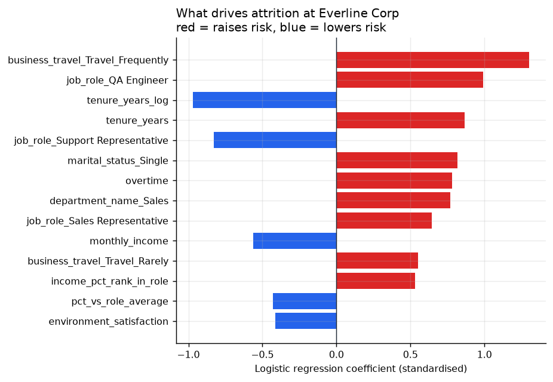
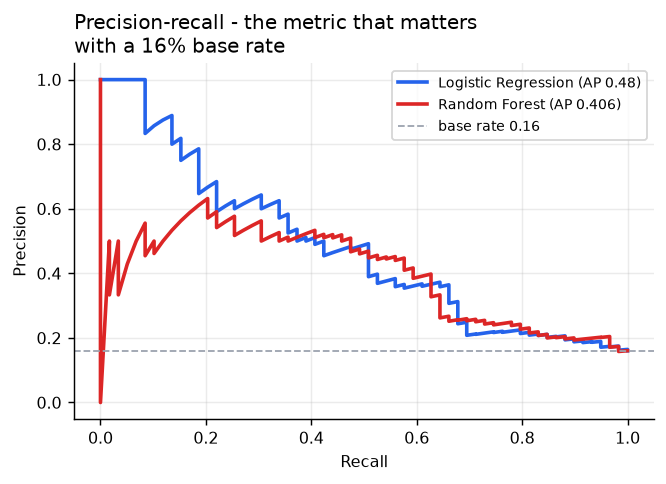
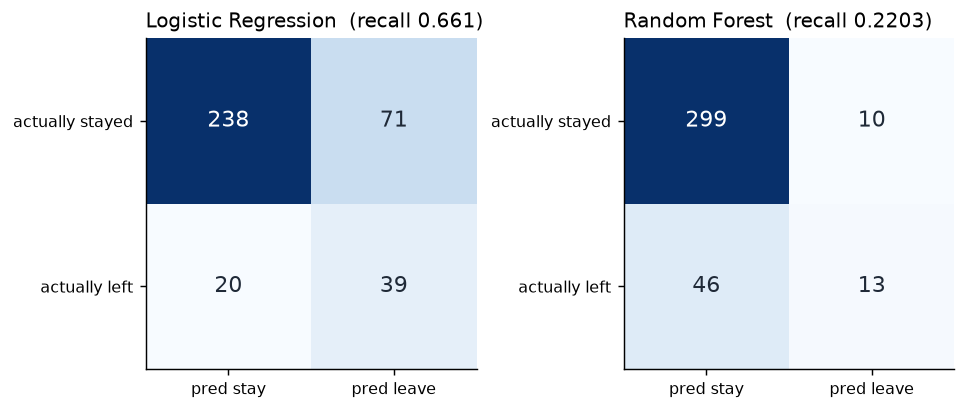

# WorkforceIQ

**HR analytics and attrition-risk platform** — a normalised PostgreSQL schema, an
analytical SQL layer, a Power BI semantic model with time-intelligence DAX, and a
scikit-learn model whose output feeds back into the database.

> **[▶ Live interactive dashboard](docs/index.html)** — six findings, a
> tenure-controlled department ranking, and a filterable flight-risk watchlist.
> *(Enable GitHub Pages on `/docs` to serve it, or open `web/index.html` locally.)*

```
IBM HR CSV  →  normalised Postgres schema  →  8 analytical views  ┬→  Power BI (PBIP/TMDL + DAX)
  1,470 real rows       6 tables + FKs       window fns, CTEs,    ├→  scikit-learn model
                        SCD Type 2           indirect std.        │      ↓
                                                                  └←  attrition_risk_scores
```

---

## 1. Business scenario

Everline Corp, a 1,470-employee company across 6 departments (Sales, Engineering,
HR, Finance, Operations, Customer Support), has seen attrition creep up over the
last two fiscal years. Leadership wants a single trusted view of attrition trends
by department / role / tenure, the underlying drivers, and a proactive list of
employees currently at elevated flight risk — replacing an ad-hoc quarterly PDF
report.

The headline result is that **the quarterly PDF was ranking departments on a
metric that rewarded the ones that stopped hiring.** See finding 6.

### What is real and what is constructed

Stated first, because it changes how every number below should be read.

Built on the public **IBM HR Analytics Employee Attrition & Performance** dataset
— 1,470 real rows. Every **driver variable and the attrition label are used
unmodified**: monthly income, job satisfaction, environment satisfaction,
work-life balance, overtime, performance rating, stock options, salary hike,
distance from home, age, gender, marital status, education, job level, years at
company, and the Attrition flag.

The source is a **single dateless snapshot**, so anything time-shaped had to be
constructed to make SCD modelling and time-intelligence DAX possible: employee
names, hire and termination dates, the per-year compensation and review rows, the
manager hierarchy, the voluntary/involuntary split, and the six-department
overlay. Full mapping table in [`docs/sql_findings.md`](docs/sql_findings.md).

**Consequence:** findings 2–6 are about *drivers* and are real signal from the
source data. Finding 1's quarter-over-quarter *slope* is partly by construction
and is labelled as a technique demonstration rather than an insight.

Headcount is 1,470 rather than a round "~2,000" because padding the population
with ~530 invented employees would have diluted a real attrition label with
synthetic ones and made every rate below partly fictional.

---

## 2. Schema

Full DDL with foreign keys, check constraints and indexes:
[`sql/schema.sql`](sql/schema.sql). Source: [`docs/er_diagram.mmd`](docs/er_diagram.mmd).

```mermaid
erDiagram
    departments ||--o{ employees : "employs"
    employees   ||--o{ employees : "manages (self-FK)"
    employees   ||--o{ compensation_history : "earns over time"
    employees   ||--o{ performance_reviews : "is reviewed"
    employees   ||--o| attrition_events : "may depart"
    employees   ||--o{ attrition_risk_scores : "is scored"
    dim_date    ||--o{ attrition_events : "dates"

    departments {
        int department_id PK
        varchar department_name UK
        varchar division
    }
    employees {
        int employee_id PK
        int department_id FK
        varchar job_role
        date hire_date
        int manager_id FK "self-referencing"
        varchar current_status "Active | Terminated"
    }
    compensation_history {
        int comp_id PK
        int employee_id FK
        date effective_date "SCD Type 2"
        int monthly_income
        numeric salary_hike_pct
        smallint stock_option_level
    }
    performance_reviews {
        int review_id PK
        int employee_id FK
        date review_date
        smallint job_satisfaction
        smallint work_life_balance
        varchar overtime_flag
        int manager_id FK "manager at review time"
    }
    attrition_events {
        int event_id PK
        int employee_id FK UK
        date termination_date
        smallint voluntary_flag
    }
    attrition_risk_scores {
        int employee_id PK_FK
        date scored_date PK
        varchar model_name PK
        numeric risk_score
        varchar risk_tier "Low | Medium | High"
    }
    dim_date {
        date date_key PK
        smallint year
        smallint quarter
        boolean is_month_end
    }
```

Three design decisions worth calling out:

- **`employee_id` is a natural key**, carried from the source HRIS extract rather
  than a surrogate serial, so a refreshed extract does not require remapping
  identities across the model and the scoring job.
- **`compensation_history` and `performance_reviews` are effective-dated** (SCD
  Type 2 pattern) rather than one mutable row per employee. This is what makes
  point-in-time questions — *"what was this person paid when they resigned?"* —
  answerable at all.
- **`attrition_risk_scores` has a composite PK on `(employee_id, scored_date,
  model_name)`.** Every scoring run is retained instead of overwritten, so model
  drift is observable rather than lost.

`dim_date` is not in the original brief but is required: Power BI time-intelligence
DAX needs a contiguous marked date table, and deriving one from fact dates alone
leaves gaps in any period with no terminations.

---

## 3. The analytical SQL layer

Eight views in [`sql/views/`](sql/views/), one file each. Full write-ups with
method and caveats in **[`docs/sql_findings.md`](docs/sql_findings.md)**.

**Company baseline: 1,470 employees, 1,233 active, 237 departures, 16.12% crude
attrition rate.**

| # | View | Business question | Headline finding |
|---|---|---|---|
| 1 | [`vw_attrition_by_department`](sql/views/01_vw_attrition_by_department.sql) | Which departments are worst, and is one bad quarter distorting it? | HR **18.2%** and Sales **13.5%** rolling 4-quarter vs Finance **1.0%**. HR's single-quarter rate was 2.5% — reading that alone concludes HR is fine. |
| 2 | [`vw_tenure_cohort_attrition`](sql/views/02_vw_tenure_cohort_attrition.sql) | Do we lose people early or once established? | 0–1 yr has the highest *rate* (**36.4%**) but 6.8% of outflow. **1–3 yr is 36.3% of everyone who leaves.** Rate alone points the budget at the wrong cohort. |
| 3 | [`vw_compensation_percentile`](sql/views/03_vw_compensation_percentile.sql) | Do people underpaid *relative to peers* leave more? | Bottom in-role quartile **19.5%** vs Q3 **13.6%** — but Q4 ticks back up to 14.6%. Real, ~6pp, **non-monotonic**. |
| 4 | [`vw_manager_span_attrition`](sql/views/04_vw_manager_span_attrition.sql) | Do managers with bigger teams lose more people? | **No relationship.** Flat at 14.0% / 16.6% / 16.3% across 6–10, 11–15, 16+. A negative result, reported as one. |
| 5 | [`vw_overtime_satisfaction_attrition`](sql/views/05_vw_overtime_satisfaction_attrition.sql) | Do overtime and low satisfaction compound? | **Overtime + low satisfaction = 36.6%, 2.27× base and 5.3× the 6.9% of employees with neither.** Overtime alone beats low satisfaction alone. |
| 6 | [`vw_department_attrition_controlled`](sql/views/06_vw_department_attrition_controlled.sql) | Who has a *retention* problem vs a young workforce? | **Engineering's 17.6% is entirely tenure mix (SAR 1.01).** Sales (1.36) and HR (1.40) are the real problems. |
| 7 | [`vw_attrition_risk_watchlist`](sql/views/07_vw_attrition_risk_watchlist.sql) | Who is at risk right now? | Joins model output to the human context — manager, pay position, overtime — that makes a probability actionable. |
| 8 | [`vw_dim_employee`](sql/views/08_vw_dim_employee.sql) | — | The conformed wide dimension Power BI imports as `DimEmployee`. |

### The one worth explaining in an interview — finding 6

Tenure is the strongest single predictor of leaving (36.4% at 0–1 years, 10.4% at
10+). Departments do not have the same tenure mix. A department that doubled in
size is mostly 0–2 year employees — the cohort that leaves most — so it posts a
high crude rate **even if it retains people better than average at every tenure
level**. Ranking on the crude rate rewards departments that stopped hiring.

The fix is **indirect standardisation**, borrowed from epidemiology, where the
identical problem appears as comparing mortality across regions with different age
structures:

1. Compute the company-wide attrition rate **for each tenure cohort** — the
   *standard schedule*.
2. Apply that schedule to each department's **own tenure mix** → *expected leavers*.
3. `SAR = observed / expected`.

| Department | Head | Avg tenure | Observed | Expected | Crude rate | **SAR** | Verdict |
|---|--:|--:|--:|--:|--:|--:|---|
| HR | 52 | 5.8 | 12 | 8.6 | 23.1% | **1.40** | Worse than tenure predicts |
| Sales | 409 | 7.1 | 90 | 66.1 | 22.0% | **1.36** | Worse than tenure predicts |
| Engineering | 631 | 6.3 | 111 | 109.7 | 17.6% | **1.01** | In line with tenure mix |
| Operations | 145 | 8.1 | 10 | 20.4 | 6.9% | **0.49** | Better than tenure predicts |
| Customer Support | 131 | 8.9 | 9 | 18.5 | 6.9% | **0.49** | Better than tenure predicts |
| Finance | 102 | 15.0 | 5 | 13.7 | 4.9% | **0.37** | Better than tenure predicts |

**Engineering accounts for 111 of 237 departures — 47% of all outflow — and on the
old report it looked like the problem to solve. Its SAR is 1.01.** It loses almost
exactly what its tenure mix predicts. That is a hiring-volume consequence, not a
retention failure, and a retention task force sent there would find nothing to fix.
**Sales is where it belongs**: same effect size as HR, across 409 people rather
than 52.

*What this does not claim:* SAR adjusts for **tenure mix only**. Role mix, pay
position and overtime exposure remain uncontrolled. Two departments with the same
SAR are comparable on tenure, not on everything.

---

## 4. Power BI

[`powerbi/`](powerbi/) — a **PBIP project with a full TMDL semantic model**:
14 tables, 6 relationships, and **22 documented DAX measures**
([`powerbi/measures.dax`](powerbi/measures.dax)). Page-by-page spec in
[`powerbi/REPORT_BUILD_GUIDE.md`](powerbi/REPORT_BUILD_GUIDE.md).

Connects to PostgreSQL **through the native connector against the analytical
views** — not a CSV import. That distinction matters: most portfolio dashboards
import a flat file and throw away the entire SQL layer.

### On the missing `.pbix`

**There is deliberately no `.pbix` binary in this repo.** A `.pbix` can only be
written by Power BI Desktop, which is Windows-only and was not available in the
environment this repo was built in — shipping one would have meant shipping
something untested.

That is not much of a loss. **PBIP/TMDL is the format you want in source control**
— a `.pbix` is an opaque blob that cannot be diffed, reviewed or merged, which is
why Microsoft built PBIP. Desktop opens the `.pbip` natively and `File → Save As`
produces a binary in one step. The semantic model — tables, relationships, every
measure — is complete and version-controlled; only the visual layout is specified
as a build guide rather than serialised, because PBIR visual JSON is version-pinned
and could not be validated here.

### Selected measures

```dax
Attrition Rate = DIVIDE ( [Terminated Count], [Total Headcount] )

-- point-in-time headcount; ALL() is required, or the date relationship
-- restricts this to people who already left
Headcount (EOP) =
VAR AsOf = MAX ( DimDate[date_key] )
RETURN
    CALCULATE (
        COUNTROWS ( DimEmployee ),
        FILTER (
            ALL ( DimEmployee ),
            DimEmployee[hire_date] <= AsOf
                && ( ISBLANK ( DimEmployee[termination_date] )
                     || DimEmployee[termination_date] > AsOf )
        )
    )

Rolling 12-Month Attrition Rate =
VAR AsOf   = MAX ( DimDate[date_key] )
VAR Window = DATESINPERIOD ( DimDate[date_key], AsOf, -12, MONTH )
RETURN
    DIVIDE (
        CALCULATE ( [Terminated Count], Window ),
        AVERAGEX ( FILTER ( Window, DimDate[is_month_end] ), [Headcount (EOP)] )
    )

YoY Attrition Change =
    [Attrition Rate (Period)]
        - CALCULATE ( [Attrition Rate (Period)], SAMEPERIODLASTYEAR ( DimDate[date_key] ) )
```

`Flight Risk Score (Rule-Based)` implements a transparent weighted checklist so the
report can show a human-designed heuristic beside the trained model. They correlate
only **r = 0.47** — and that gap is the argument for the model.

> Dashboard screenshots go in [`docs/dashboard_screenshots/`](docs/dashboard_screenshots/)
> once the report is opened and rendered in Desktop. In the meantime the
> **[live web dashboard](docs/index.html)** shows the same findings from the same views.

---

## 5. The model

[`notebooks/attrition_risk_model.ipynb`](notebooks/attrition_risk_model.ipynb) —
committed with executed outputs and charts.

**Features are assembled by querying the same SQL views the dashboard reads**, not
re-derived in pandas. If the definition of "pay percentile within role" changes, it
changes in one place and both the model and the report move together.

### Results (held-out 25% test set, 368 employees, 59 leavers)

| | Logistic Regression | Random Forest |
|---|--:|--:|
| Recall (leavers) | **0.66** | 0.22 |
| Precision (leavers) | 0.35 | 0.57 |
| ROC-AUC | 0.739 | 0.749 |
| **5-fold CV PR-AUC** | **0.507 ± 0.065** | **0.511 ± 0.034** |

**The two models are statistically tied** — the gap in cross-validated PR-AUC
(0.004) is well inside the fold-to-fold standard deviation. The forest buys no real
accuracy, so the watchlist ships on the **logistic regression**, where a coefficient
answers the only question a manager ever asks: *why this person?*

Accuracy is excluded on purpose: at a 16.1% base rate, predicting "nobody leaves"
scores 83.9%. Everything is judged on recall and PR-AUC, and for a retention
watchlist recall is the right bias — a false positive costs one coffee
conversation, a false negative costs a replacement hire.



### What matters, by permutation importance

| Feature | Drop in PR-AUC when shuffled |
|---|--:|
| `tenure_years_log` | 0.220 |
| `overtime` | 0.178 |
| `monthly_income` | 0.102 |
| `tenure_years` | 0.092 |
| `job_role` | 0.059 |
| `pct_vs_role_average` | 0.044 |

**Tenure, overtime and compensation position — in that order.** The ranking agrees
with the SQL findings, which is the reassuring part: two independent methods on the
same data reaching the same conclusion. Overtime is the strongest *actionable*
driver, matching the 2.27× lift in finding 5.

`business_travel_Travel_Frequently` carries the largest single coefficient (odds
ratio ≈ 3.7) but ranks lower on permutation importance because it sits on a smaller
slice of the population — a good illustration of why both readings are shown.

 

### Scoring

All 1,233 active employees are scored and written to `attrition_risk_scores`.
Tiers are **quantiles of the active population** (top decile → High, next 20% →
Medium), not a 0.5 probability cutoff: under balanced class weights a 0.5 threshold
flags several hundred people, which no HR team can action. That is a capacity
decision, not a statistical one, and it is documented rather than buried.

### A bug worth documenting

An earlier version of the data generator jittered hire dates for **active employees
only**, which placed every leaver on an exact integer tenure and every stayer just
above one. That class-dependent gap was free signal the model happily exploited,
and it surfaced as an implausible **71% attrition rate in the under-1-year band**.
Fixed in [`generators/build_dataset.py`](generators/build_dataset.py) by drawing
the within-year offset identically for both classes.

It is left in the write-up because it is the whole argument for point-in-time
feature stores: synthetic-data leakage is quiet, and it flatters your metrics.

---

## 6. Running it

```bash
pip install -r requirements.txt
```

**Rebuild everything from the raw CSV** (deterministic — same bytes every time):

Order matters: `train_attrition_model.py` must run **before** `build_seed_sql.py`,
because the seed script embeds the scored watchlist it produces.

```bash
python generators/build_dataset.py         # normalise + synthesise the time dimension
python generators/train_attrition_model.py # train, evaluate, score, write charts
python generators/build_seed_sql.py        # emit sql/seed_data.sql (includes scores)
python generators/run_views_local.py       # run all 8 views on DuckDB, no server needed
python generators/build_notebook.py        # regenerate the executed notebook
python generators/build_powerbi.py         # regenerate the TMDL semantic model
python generators/build_dashboard.py       # rebuild the web dashboard
```

`run_views_local.py` executes **the exact `.sql` files that ship to Postgres**
against DuckDB, so the SQL layer can be validated and every figure in the docs
regenerated without a database server running.

**Load into PostgreSQL:**

```bash
cp .env.example .env     # add your DATABASE_URL (session pooler, port 5432)
python generators/load_to_postgres.py
python generators/verify_parity.py
```

The loader runs four steps in order — schema, seed, views, then
[`sql/rls_policies.sql`](sql/rls_policies.sql). That last step is never skipped,
because `schema.sql` opens with `DROP TABLE ... CASCADE`, and dropping a table
takes its RLS policies with it. Security applied as a one-off migration is
destroyed by the next rebuild and the tables come back open with nobody
noticing — which is exactly what happened once during this build and is why the
policies now live in the build script.

**Posture:** anonymous *read* is intentional — it is what lets the hosted
dashboard query the database with no server-side secret, over a public demo
dataset with synthesised names. Anonymous *write* is closed twice over: RLS with
SELECT-only policies, plus `INSERT/UPDATE/DELETE/TRUNCATE` revoked from `anon`
and `authenticated` outright. All 16 views are `security_invoker`, so a view
cannot bypass the policies on the table underneath it — without that, per-manager
RLS on the watchlist would be decorative.

### Cross-engine parity

Developing against DuckDB and shipping to Postgres only works if the two
actually agree, so [`generators/verify_parity.py`](generators/verify_parity.py)
runs 13 checks — including row-level comparisons across all 1,470 employees —
against both engines and exits non-zero on any difference.

It earned its place immediately by catching two bugs that raised no error on
either engine and would have shipped silently:

- **`NTILE(4)` ordered by `monthly_income` alone was non-deterministic.** NTILE
  forces equal-sized buckets, so employees sharing a salary that straddles a
  quartile boundary *must* be split — and which tied row landed in which bucket
  was arbitrary. Postgres and DuckDB disagreed by one employee on the Q3/Q4
  boundary. Fixed with an `employee_id` tiebreaker.
- **`::NUMERIC` with no precision meant two different things.** Postgres reads
  it as arbitrary precision; DuckDB defaults it to `DECIMAL(18,3)`. So
  `ROUND(x::NUMERIC, 4)` silently truncated pay percentiles to three decimals on
  DuckDB only, and the engines differed by up to 0.0005. Fixed with an explicit
  `NUMERIC(12,8)`.

Both were quiet wrong-answer bugs, which is the kind a test has to catch because
review will not.

Or with `psql` alone:

```bash
psql "$DATABASE_URL" -f sql/schema.sql
psql "$DATABASE_URL" -f sql/seed_data.sql
for f in sql/views/*.sql; do psql "$DATABASE_URL" -f "$f"; done
```

---

## 7. Repo structure

```
WorkforceIQ/
├── sql/
│   ├── schema.sql                 DDL: 7 tables, FKs, checks, indexes
│   ├── seed_data.sql              generated INSERT script (~1.1 MB)
│   ├── rls_policies.sql           RLS, read-only grants, security_invoker
│   └── views/                     8 analytical views, one file each
├── generators/
│   ├── build_dataset.py           CSV → normalised tables + time dimension
│   ├── build_seed_sql.py          → sql/seed_data.sql
│   ├── feature_store.py           feature assembly via the SQL views
│   ├── train_attrition_model.py   train, compare, score, chart
│   ├── run_views_local.py         run the shipped .sql on DuckDB
│   ├── load_to_postgres.py        build the live database
│   ├── verify_parity.py           assert Postgres and DuckDB agree
│   ├── build_notebook.py          generate + execute the notebook
│   ├── build_powerbi.py           generate the TMDL semantic model
│   └── build_dashboard.py         inline data → web dashboard
├── notebooks/attrition_risk_model.ipynb
├── powerbi/
│   ├── WorkforceIQ.pbip
│   ├── WorkforceIQ.SemanticModel/ TMDL: 14 tables, 22 measures
│   ├── measures.dax
│   └── REPORT_BUILD_GUIDE.md
├── web/                           dashboard template + data payload
├── docs/
│   ├── sql_findings.md            the full write-up
│   ├── er_diagram.mmd
│   ├── charts/                    model charts
│   ├── index.html                 built dashboard (GitHub Pages)
│   └── view_results.json          every figure, regenerated on demand
└── data/{raw,processed}/
```

---

## 8. What I'd do differently in production

**Ingestion.** The static CSV would be a scheduled pull from the HRIS (Workday,
BambooHR) via API into a staging schema, with dbt handling the transform into these
tables and `dbt test` enforcing the constraints that are currently only DDL checks.

**Point-in-time features.** The single biggest correctness gap. `tenure_years` is
measured at termination for leavers and at snapshot for actives, which is right for
"what did tenure look like when they left" but means the two classes see slightly
different distributions. A real feature store snapshotting every employee at a fixed
lookback date removes the whole class of bug described in section 5.

**Model monitoring.** `attrition_risk_scores` retains every run so drift is
*observable*, but nothing currently watches it. Production needs PSI on the feature
distributions, monthly retraining, and — crucially — **tracking whether flagged
employees actually left**, which is the only real measure of whether this works.
Right now there is no feedback loop.

**Row-level security.** The Watchlist names individuals. Managers must see only
their own team, via an RLS role on `DimEmployee[manager_name] = USERPRINCIPALNAME()`
mapped to Entra. Without it, every manager in the tenant can read every flight-risk
score in the company — a genuine HR-confidentiality failure, not a nice-to-have.

**Incremental refresh.** `compensation_history` and `performance_reviews` grow
monotonically; full refresh is fine at 1,470 employees and wrong at 50,000. Partition
on `effective_date` / `review_date` and refresh only the trailing window.

**Governance on the model output.** A flight-risk score attached to a named employee
is sensitive personal data. Production needs a retention policy on
`attrition_risk_scores`, an audit log of who viewed the watchlist, and an explicit
written policy that scores may never inform performance or termination decisions —
enforced by process, not just a disclaimer on a report page.

**Causal inference.** Every finding here is associational. "Overtime predicts
leaving" is not "cutting overtime will stop people leaving". The overtime finding is
strong enough to justify a proper test — a staggered rollout of workload caps across
teams, with difference-in-differences on the result.

---

## Tech

PostgreSQL 15 · DuckDB (local validation) · Python 3.13 · pandas · scikit-learn ·
Power BI (PBIP/TMDL, DAX) · vanilla JS dashboard, no framework

Source data: [IBM HR Analytics Employee Attrition & Performance](https://www.kaggle.com/datasets/pavansubhasht/ibm-hr-analytics-attrition-dataset)
(1,470 rows, public sample dataset). Employee names are synthetic; no real personal
data is present in this repository.
